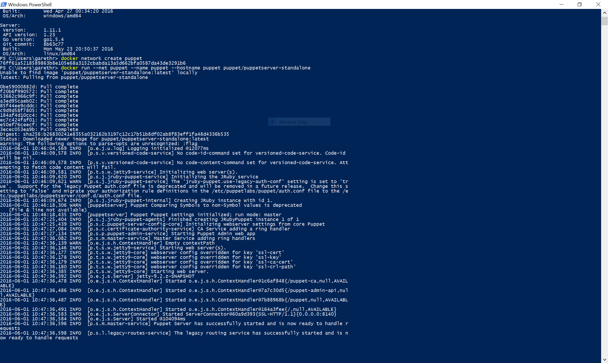
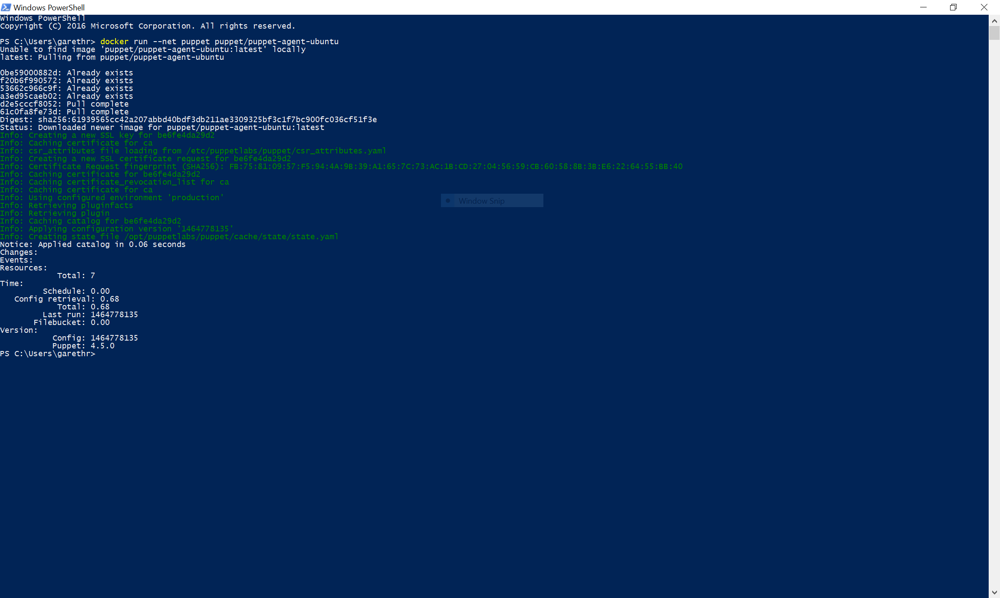

# Puppet-in-Docker on Windows

With the release of the recent [Docker for Windows beta](https://blog.docker.com/2016/03/docker-for-mac-windows-beta/)
it's possible to run Linux docker containers, including Puppet-in-Docker,
on Windows. This isn't the same as the native Windows container support
coming in Server 2016 but is still useful for local development purposes.
For the following demo you'll first need to [sign up](https://beta.docker.com/)
for the Docker beta and install it on your Windows machine.

With docker running, open up a PowerShell prompt and create a docker
network:

    docker network create puppet

We can then run a copy of Puppet Server. The standalone part refers to
the fact this image does not automatically connect to PuppetDB. That's
fine for this simple demo, but in other cases you may prefer the
`puppet/puppetserver` image.

    docker run --net puppet --name puppet --hostname puppet puppet/puppetserver-standalone

Here's that running in PowerShell:

The container should boot and, as we're running in the foreground,
it should print lot output to the console. Once running we can
run a simple puppet agent in another container. Open up a second
PowerShell window and run:

    docker run --net puppet puppet/puppet-agent-ubuntu

Here's that running in PowerShell too:

As mentioned this is mainly useful for development purposes today
but for those used to a Windows development environment this avoids
the need to manage the intermediary VM and install software using
an unfamiliar Linux interface.
